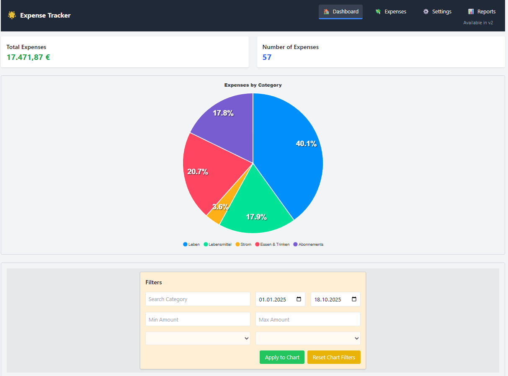
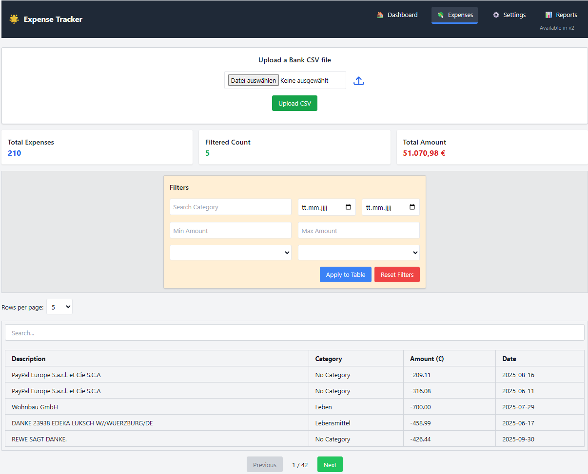
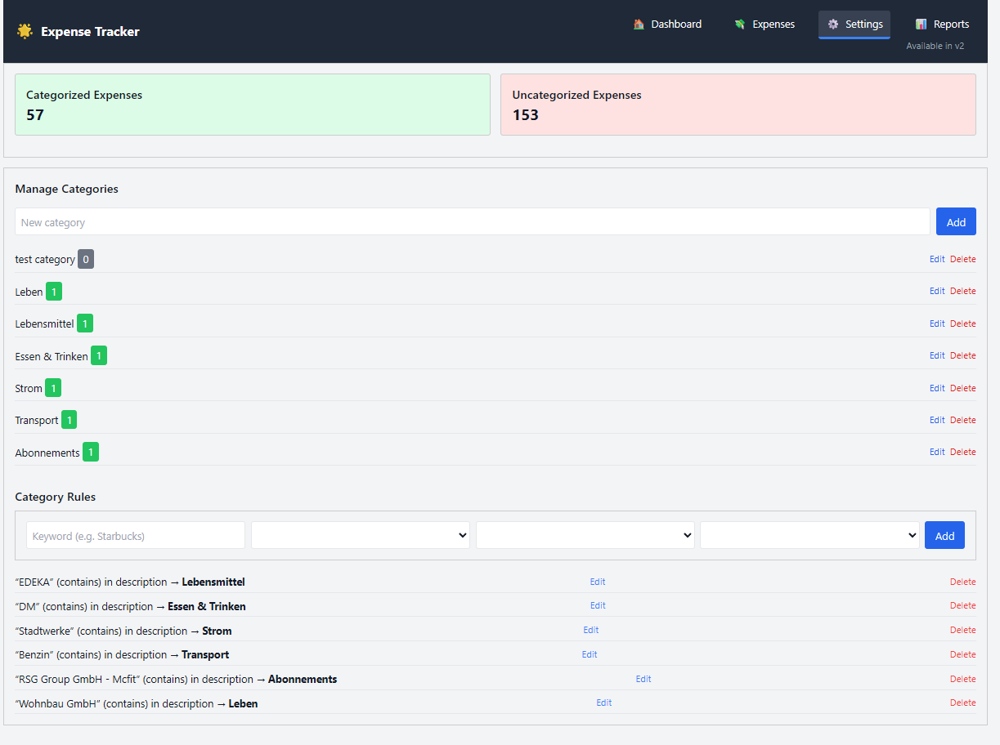

# Expense Tracker App

A full-stack expense tracking app built with **Laravel 11** and **Vue 3**.
It helps import bank CSV transactions, detect duplicates, and auto-categorize expenses with rules.

---

## 🚀 Overview

This project is designed to make personal expense tracking faster and more structured.
Instead of entering transactions manually, you can upload a CSV export from your bank, preview the parsed rows, and save only the valid non-duplicate entries.

The app then uses category rules to organize expenses automatically and exposes dashboard/report endpoints for filtering and summary views.

---

## ✨ What the project does

- Imports transaction data from CSV files
- Parses bank-formatted dates, descriptions, and amounts
- Detects duplicate transactions before saving
- Auto-categorizes expenses using configurable rules
- Lets you manage categories and matching rules
- Shows dashboard totals, filters, pagination, and charts

---

## 🧱 Main project modules

### 🖥️ Frontend SPA (`Vue 3`)
Main app shell lives in `resources/js/components/App.vue`.

Core UI sections:
- `DashboardSection.vue` — filters, totals, charts, and expense browsing
- `ExpensesSection.vue` — CSV upload flow and import preview
- `SettingsPanel.vue` — category and rule management

Shared frontend logic:
- `resources/js/composables/useDashboardApi.js`
- `resources/js/composables/useExpenses.js`
- `resources/js/composables/useSettingsPanel.js`

Reusable UI pieces include:
- `Navbar.vue`
- `FiltersPanel.vue`
- `TableView.vue`
- `Pagination.vue`
- `ToastNotification.vue`
- `ConfirmModal.vue`

### 🛠️ Backend API (`Laravel 11`)
API routes are defined in `routes/api.php`.

Main controllers:
- `DashboardController` — filtered expense listing and totals
- `ExpenseUploadController` — CSV parsing, duplicate detection, preview, save, category summary
- `ExpenseController` — available months/years for filters
- `CategoryController` — category CRUD and categorized-counts stats
- `RuleController` — rule CRUD and rule re-application logic

### 🗄️ Data layer
Core Eloquent models:
- `Expense`
- `Category`
- `Rule`
- `User`

Relationships:
- A `Category` has many `Expense`
- A `Category` has many `Rule`
- An `Expense` belongs to a `Category`
- Records are structured to support user scoping through `user_id`

---

## 🔄 High-level workflow

### 1. CSV import flow
1. User uploads a CSV file in the Expenses view
2. Backend validates the file
3. CSV rows are parsed and normalized
4. Existing expenses are checked for duplicates
5. Matching rules try to assign categories automatically
6. A preview payload is returned to the frontend
7. User confirms save
8. Non-duplicate expenses are inserted into the database

### 2. Categorization flow
1. Categories and rules are created in Settings
2. Each rule defines a match type such as:
   - `contains`
   - `equals`
   - `regex`
3. When CSV rows are processed, rules are tested against the transaction description
4. If a match is found, the expense is linked to the corresponding category

### 3. Dashboard flow
1. Frontend requests filtered data from `/api/dashboard`
2. Backend applies query filters dynamically
3. Expenses are returned with pagination and totals

---

## 🧭 Architecture at a glance

```text
Browser (Vue SPA)
    |
    +-- App.vue
         |
         +-- DashboardSection
         +-- ExpensesSection
         +-- SettingsPanel
         |
         +-- composables (axios API calls)
                |
                v
          Laravel API (`routes/api.php`)
                |
                +-- DashboardController
                +-- ExpenseUploadController
                +-- ExpenseController
                +-- CategoryController
                +-- RuleController
                |
                v
            MySQL database
                |
                +-- users
                +-- categories
                +-- rules
                +-- expenses
```

For the full ASCII workflow diagram, see `WORKFLOW.md`.

---

## 📸 Screenshots / Demo

> Screenshots are stored in `docs/images/`.

### Dashboard


### CSV Upload Preview


### Settings - Rules


---

## 📥 Manual CSV Input

A sample transaction file is included in the repository:

- `database/seed-data/transaktionen_seeder.csv`

After starting the app, import it manually from the UI:

1. Open the app in your browser
2. Go to the **Expenses** section
3. Use the CSV upload area to select `transaktionen_seeder.csv`
4. Review the preview and confirm save

> Note: this file is a manual import source, not an automatic Laravel seeder.

---

## 📡 API snapshot

### Dashboard
- `GET /api/dashboard`

### Expenses
- `POST /api/expenses/upload`
- `POST /api/expenses/save`
- `GET /api/expenses/summary-by-category`
- `GET /api/expenses/available-months-years`

### Categories
- `GET /api/categories`
- `POST /api/categories`
- `PUT /api/categories/{id}`
- `DELETE /api/categories/{id}`
- `GET /api/categories/categorized-counts`

### Rules
- `GET /api/rules`
- `POST /api/rules`
- `PUT /api/rules/{id}`
- `DELETE /api/rules/{id}`

---

## 🧠 Main business logic

### CSV processing
Handled in `ExpenseUploadController`.

It is responsible for:
- validating uploaded files
- reading CSV content
- handling encoding conversion when needed
- parsing localized amount/date formats
- preparing a preview before persistence

### Duplicate detection
Before saving, the app compares imported rows against existing transactions using key fields such as:
- date
- amount
- description

This helps prevent accidental double imports.

### Rule-based categorization
Rules are managed through `RuleController` and linked to categories.

They allow the app to automatically label transactions based on the description text, improving over time as more rules are added.

---

## 📁 Important paths

- `app/Http/Controllers/` — backend API logic
- `app/Models/` — Eloquent models
- `routes/api.php` — API endpoints
- `routes/web.php` — SPA catch-all route
- `resources/js/components/` — Vue UI components
- `resources/js/composables/` — frontend API/state helpers
- `database/migrations/` — schema definitions
- `WORKFLOW.md` — detailed ASCII architecture/workflow document

---

## ⚙️ Tech stack

- **Backend:** Laravel 11, PHP 8.2+
- **Frontend:** Vue 3, Vite
- **Styling:** Tailwind CSS
- **Charts:** ApexCharts
- **CSV parsing:** `league/csv`
- **Database target:** MySQL

> Note: Laravel config currently falls back to SQLite by default if `DB_CONNECTION` is not set in `.env`. For this project, configure `.env` for MySQL before running migrations in your real environment.

---

## 🏁 Quick start

### 1. Install dependencies

```bash
composer install
npm install
```

### 2. Configure environment

```bash
cp .env.example .env
php artisan key:generate
```

Update your `.env` for MySQL:

```env
DB_CONNECTION=mysql
DB_HOST=127.0.0.1
DB_PORT=3306
DB_DATABASE=expense_tracker
DB_USERNAME=root
DB_PASSWORD=
```

### 3. Run migrations

```bash
php artisan migrate
```

### 4. Start the app

```bash
php artisan serve
npm run dev
```

Or use the combined Laravel dev script:

```bash
composer run dev
```

---

## 🧪 Development notes

- The web layer uses a catch-all route in `routes/web.php` to serve the SPA shell
- Most application behavior is driven through `/api/*` endpoints
- Rule quality directly improves automatic categorization accuracy
- `WORKFLOW.md` contains the full architecture and import sequence in ASCII form

---

## 🛣️ Roadmap ideas

- Add authentication and per-user dashboards
- Add export to CSV/PDF for dashboards
- Add recurring expense detection
- Add monthly budgets and alerts

---

## 🤝 Contributing

Contributions are welcome.

1. Fork the repo
2. Create a feature branch
3. Commit your changes
4. Open a pull request

---

## 📄 License

This project is licensed under the MIT License.
